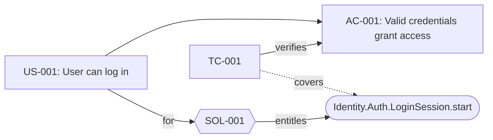

# 19. Requirements & traceability

Three analytical artefacts sit *above* the domain model and reference it **one-directionally** — the generated code stays clean (no `implements` back-links): a `requirement` is a work item with an optional `parent` hierarchy, a `solution` is the design rationale that `entitles` the code symbols it legitimises, and a `testCase` `verifies` a requirement and `covers` the code it exercises. Executable `test`s back-link to a test case, completing the chain `Requirement → Solution → TestCase → test → Code`. Reach for this chapter to spec *why* the model looks the way it does and to gate a build on whether each requirement's tests actually passed.

> **Grammar:** `Requirement`, `RequirementProp`, `Solution`, `TestCase`, `TraceId`, `Targetable`, `QualifiedName` · **Validators:** `checkRequirement` (`src/language/validators/traceability.ts`) · **Docs:** [`../traceability.md`](../traceability.md), [`Testing & verification`](18-testing.md)

These are platform-neutral `.loom/` artefacts — `requirement` / `solution` / `testCase` emit no backend or frontend code, only the derived views under `<out>/.loom/`. So every example below is plain output (no platform tabs). Everything was generated from one scratch system via `node bin/cli.js generate system trace.ddd -o out` and `node bin/cli.js verify trace.ddd --results results.json`. The full source:

```ddd
requirement US-001 {
  type: UserStory
  title: "User can log in"
  status: InProgress
  priority: 1
}

requirement AC-001 parent US-001 {
  type: AcceptanceCriteria
  title: "Valid credentials grant access"
}

system Shop {
  subdomain Identity {
    context Auth {
      aggregate LoginSession {
        reference: string
        operation start() {}
        test "successful login" verifies TC-001 {}
      }
    }
  }
  api AuthApi from Identity
  storage primarySql { type: postgres }
  resource authState { for: Auth  kind: state  use: primarySql }
  deployable apiNode {
    platform: node
    contexts: [Auth]
    dataSources: [authState]
    serves: AuthApi
  }
}

solution SOL-001 for US-001 {
  title: "Login handled by the LoginSession aggregate"
  entitles [
    Identity.Auth.LoginSession.start,
    apiNode
  ]
}

testCase TC-001 verifies AC-001 {
  title: "Successful login"
  covers [ Identity.Auth.LoginSession.start ]
}
```

## `requirement`

```
Requirement:      'requirement' name=TraceId ('parent' parent=[Requirement:TraceId])? '{' props+=RequirementProp* '}'
RequirementProp:  name=RequirementPropKey ':' value=Expression
```

A generalised work item. The body is a permissive key/value prop-bag — the keys are *not* grammar keywords (promoting `status` / `priority` would steal common domain identifiers), so the validator (`checkRequirement`) enforces the closed set instead:

| Key | Required | Allowed values |
|---|---|---|
| `type` | yes | `UserStory` \| `UseCase` \| `AcceptanceCriteria` \| `BusinessReq` |
| `title` | yes | string literal |
| `status` | no | `Draft` \| `Approved` \| `InProgress` \| `Done` |
| `priority` | no | integer |

An unknown key, a duplicate key, a bad enum value, a missing `type`/`title`, or a non-integer `priority` is a hard error; so is a cyclic `parent` chain.

```ddd
requirement US-001 {
  type: UserStory
  title: "User can log in"
  status: InProgress
  priority: 1
}

requirement AC-001 parent US-001 {
  type: AcceptanceCriteria
  title: "Valid credentials grant access"
}
```

`parent` builds the hierarchy (here `AC-001` is a child of `US-001`); coverage and verification roll a test on a child up to its ancestors. The emitted spec renders the tree with each requirement's solution, tests, and covered code inlined:

```md
# Traceability

## Requirements

- **US-001** [UserStory] User can log in _(InProgress)_
  - solution: `SOL-001`
  - tests: `TC-001`
  - **AC-001** [AcceptanceCriteria] Valid credentials grant access
    - tests: `TC-001`
```

### Identifiers (`TraceId`)

```
TraceId returns string: TRACE_ID | ID;
```

Names are **ticket-style ids** — `US-001`, `AC-001`, `SOL-001`, `TC-001` — backed by a dedicated `TRACE_ID` terminal so hyphens and **leading zeros are preserved verbatim** (a parser-level `ID ('-' INT)*` would collapse `US-001` and `US-01`). A plain identifier (`Login`, `US001`) is also accepted for hyphen-free names.

## `solution`

```
Solution:
  'solution' name=TraceId 'for' requirement=[Requirement:TraceId] '{'
    ('title' ':' title=STRING)?
    ('entitles' '[' (entitles+=[Targetable:QualifiedName] (',' …)* ','?)? ']')?
  '}';
```

The design rationale ("talkback") for one requirement. `for` links it to the requirement it justifies; `entitles [...]` lists the concrete code symbols that requirement legitimises.

```ddd
solution SOL-001 for US-001 {
  title: "Login handled by the LoginSession aggregate"
  entitles [
    Identity.Auth.LoginSession.start,
    apiNode
  ]
}
```

The solution catalogue in `traceability.md` records the `for` edge and resolves each entitlement to its **kind** (operation, deployable, …):

```md
## Solutions

### SOL-001 — Login handled by the LoginSession aggregate
for: `US-001`

Entitles:
- `Identity.Auth.LoginSession.start` (operation)
- `apiNode` (deployable)
```

## `testCase`

```
TestCase:
  'testCase' name=TraceId 'verifies' requirement=[Requirement:TraceId] '{'
    ('title' ':' title=STRING)?
    ('covers' '[' (covers+=[Targetable:QualifiedName] (',' …)* ','?)? ']')?
  '}';
```

A verification artefact: `verifies` links it to the requirement it tests, `covers [...]` lists the code it exercises. The executable-test back-link (see [`verifies` from tests](#verifies-from-tests)) is what marks a test case actually *run*.

```ddd
testCase TC-001 verifies AC-001 {
  title: "Successful login"
  covers [ Identity.Auth.LoginSession.start ]
}
```

```md
## Test cases

### TC-001 — Successful login
verifies: `AC-001`
executable tests: "successful login"

Covers:
- `Identity.Auth.LoginSession.start` (operation)
```

### Code references (`entitles` / `covers`)

```
QualifiedName returns string: LooseName ('.' LooseName)*;
type Targetable = Subdomain | BoundedContext | Aggregate | ValueObject | EventDecl
                | Repository | Workflow | View | Operation | Deployable | Api;
```

Both `entitles` and `covers` take **qualified cross-references** into the domain model — `Module.Context.Aggregate.operation` down to a whole subdomain, plus `deployable`s and `api`s. They resolve through Loom's qualified-name index, so they are real symbols (go-to-definition, find-references, rename, edit-time validation) — not magic strings. The qualified name **omits the enclosing `system`** (a reference reads the same regardless of which system ships the symbol); deployables and apis, as direct children of `system`, resolve by their bare name (`apiNode`). `LooseName` segments mean a symbol whose name is a reserved word — e.g. a `deployable api { … }` — is still addressable.

### Relations summary

| Relation | Direction | Keyword |
|---|---|---|
| Hierarchy | Requirement → Requirement | `parent` |
| Justification | Solution → Requirement | `for` |
| Verification | TestCase → Requirement | `verifies` |
| Entitlement | Solution → code symbol | `entitles [...]` |
| Coverage | TestCase → code symbol | `covers [...]` |
| Execution | `test` / `test e2e` → TestCase | `verifies` |

## `verifies` from tests

```
Test: 'test' name=STRING ('verifies' verifies=[TestCase:TraceId])? '{' … '}'
```

An executable `test` (inside an aggregate) — or a top-level `test e2e` — back-links to a test case with `verifies`. This is the edge that turns *coverage* ("a test case exists") into *verification* ("its test ran and passed").

```ddd
aggregate LoginSession {
  operation start() {}
  test "successful login" verifies TC-001 {}
}
```

The link is recorded under `index.execTests` in `traceability.json`, keyed by the test's `(name, suite)` — the `suite` is the aggregate name for unit tests, `"<System> e2e"` for e2e tests:

```json
"execTests": [
  { "name": "successful login", "suite": "LoginSession", "kind": "unit", "testCaseId": "TC-001" }
]
```

## Generated artefacts

`generate system` emits the `.loom/` traceability bundle whenever the source declares **at least one** requirement / solution / test case — once per build at the output root (the artefacts are model-global, so a solution may reference code across systems). They are derived views, regenerated every build — not contracts.

| Artefact | Content |
|---|---|
| `traceability.md` | Requirement tree with each requirement's solution, tests, covered code; solution + test-case catalogues. |
| `coverage.md` | Code / requirement / solution coverage with roll-up percentages. |
| `gaps.md` | User stories without a solution, requirements without tests, entitled-but-untested code, test cases without an executable test. |
| `traceability-matrix.md` | Requirements × test cases and code × test cases grids. |
| `traceability.mmd` | Mermaid graph of the full chain. |
| `traceability.json` | Machine-readable index + coverage summary for CI gates. |

### Coverage semantics

`coverage.md` rolls three numbers. **Code coverage** — a referenced symbol is covered when some `testCase` `covers` it; the denominator is the union of everything any solution `entitles` or any test case `covers`. **Requirement coverage** — covered when a test case verifies it *or one of its transitive children*. **Solution coverage** — the fraction of a solution's entitlements covered by some test case.

In the example `apiNode` is entitled but covered by no test case, so code coverage is 50% and the solution is 50% — but requirement coverage is 100% because the test on the child `AC-001` rolls up to `US-001`:

```md
## Code coverage
Overall: **50%** (1/2 referenced code elements covered by a test case).
| Code element | Kind | Tests | Covered |
| `Identity.Auth.LoginSession.start` | operation | 1 | ✅ |
| `apiNode` | deployable | 0 | ❌ |

## Requirement coverage
Overall: **100%** (2/2 requirements have a verifying test, counting tests on child requirements).
| `US-001` | UserStory | 1 | ✅ |
| `AC-001` | AcceptanceCriteria | 1 | ✅ |
```

The uncovered entitlement also surfaces in `gaps.md` under "Referenced code without a covering test":

```md
## Referenced code without a covering test
- `apiNode` (deployable)
```

The Mermaid graph (`traceability.mmd`) shapes nodes by kind — requirements are boxes, solutions hexagons, code elements rounded/parallelogram — and draws `for` / `entitles` / `verifies` / `covers` edges:



## `ddd verify` — Definition of Done

Coverage says a requirement *has* a test; **verification** says that test *passed*. `ddd verify` joins an existing test-results JSON onto the requirement graph (it does **not** run the suites) and gates the exit code.

```bash
ddd verify <file.ddd> --results <results.json> [--out <dir>] [--require-all] [--min <pct>] [--json]
```

`results.json` is your runner's report normalised to `{ "version": 1, "results": [{ "name", "status": "pass"|"fail"|"skip", "suite" }] }` (vitest `--reporter=json`, `dotnet test` trx, Playwright JSON). The join is by `(suite, name)`: each executable test's name is the DSL string emitted verbatim as `it("…")` / `[Fact(DisplayName="…")]` / `test("…")`, and its `suite` is the aggregate name (unit) or `"<System> e2e"` (e2e). Each test case rolls up to a status and each requirement to a verdict:

| Verdict | Meaning |
|---|---|
| `VERIFIED` | every test case for the requirement (and its children) ran and passed |
| `FAILING` | a backing test failed |
| `UNVERIFIED` | the requirement has test cases, but their tests didn't all run |
| `UNTESTED` | no test case verifies the requirement or any child |

A passing `results.json`:

```json
{ "version": 1, "results": [
  { "name": "successful login", "status": "pass", "suite": "LoginSession" }
] }
```

writes `.loom/verification.{md,json,mmd}` (the `.mmd` is a verdict-coloured requirements graph) and exits `0`:

```
Verified 2/2 requirements (0 failing, 0 unverified, 0 untested).
```

```md
# Verification
Verified **100%** of requirements — 2 verified, 0 failing, 0 unverified, 0 untested (of 2).

## Requirements
- ✅ **US-001** (VERIFIED) User can log in
  - ✅ **AC-001** (VERIFIED) Valid credentials grant access

## Test cases
| Test case | Status | Backing tests |
| `TC-001` | VERIFIED | successful login (pass) |
```

Flip that one result to `"fail"` and the gate fails — the chain inverts (the failing test case fails `AC-001`, which rolls up to `US-001`):

```
Verified 0/2 requirements (2 failing, 0 unverified, 0 untested).
Verification gate failed: 2 requirement(s) failing.   # exit 1
```

The exit code is the CI contract: `0` — gate passes; `1` — a requirement is `FAILING` (default), below `--min`, or not all `VERIFIED` under `--require-all`; `2` — bad input (parse/validation error, missing or malformed results). In the playground the **Tests** panel performs the same join live, reading `.loom/traceability.json`'s `execTests` provenance against the panel's results so each requirement's verdict badge updates in place as you run tests.
